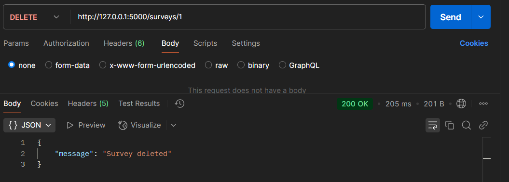

# Тестування працездатності системи

## Запуск сервера:

## POST users:

## GET users:

## PUT users:

## POST surveys:

## GET surveys:

## DELETE surveys:

## POST responses:

## POST questions:

## POST answers:

